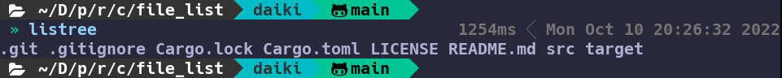
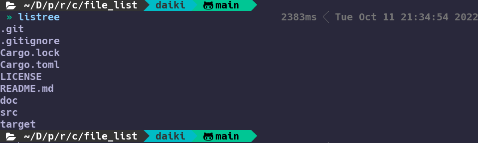

# History of this tool

This command line tool is the first piece I published on [crates.io](https://crates.io/crates/listree).

I will add features little by little as I study Rust.

## v0.1.0

Publication date is 10/10/2022.

### Feature

Obtain file and directory information in the current directory.  
Displays everything without distinction between dotfile, file, and directory.

## v0.2.0

Publication date is 10/11/2022.

### Feature

The display content is unchanged from `v0.1.0` .  
However, it is changed to display a new line.
